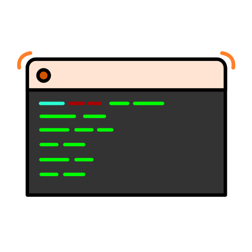
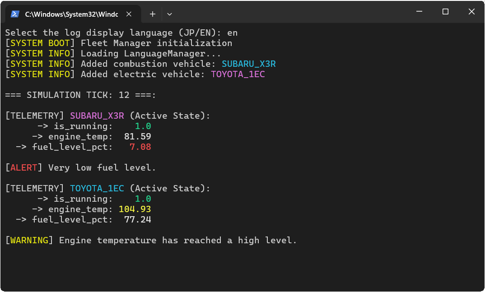

# Telemetry and Vehicle Fleet Simulation System

<br>
<br>
<br>

<p align="center">
  
</p>

## Description
An advanced console application in modern C++ simulating the operation of a telemetry system and real-time management of a diverse vehicle fleet. The project was designed to reflect the realities of embedded systems (automotive) and event-driven architecture (Event-Driven Simulation).

#### Requirements

- Windows `11`
- MSVC `Visual Studio 2022`
- cmake `3.20 or newer`


## Launching

1. Download the project from github.
2. Go to project directory using terminal.
3. Create build folder and make cmake files.

```bash
New-Item build
cmake -S . -B build
```

4. Compile the project.

```bash
cmake --build ./build --target system
```

5. Run project.

```bash
cd build/Debug
./system
```
For the best experience, run the system in a cleared, maximized terminal.

## Key System Features

* **Advanced Polymorphism and OOP Architecture:** Utilization of clean interfaces (abstract `Vehicle` class) to manage diverse powertrain types (internal combustion vehicles with AWD drivetrain simulation and EV electric vehicles) within a single fleet container.
* **Safe Memory Management (Modern C++):** Complete avoidance of raw pointers in favor of smart pointers (`std::unique_ptr`), ensuring no memory leaks and strict ownership control of objects.
* **Safety System (Fail-Safe Logic):** Each vehicle possesses autonomous physical condition monitoring systems. In the event of anomaly detection (e.g., critical engine or inverter temperature overrun), the system automatically cuts the ignition and transitions into a fail-safe state.
* **Text User Interface (ANSI TUI):** A smoothly refreshing console dashboard utilizing ANSI escape sequences (flicker-free refreshing and non-invasive buffer overwriting).
* **System Reliability (Graceful Shutdown):** Handling of system signals (POSIX/Windows Signals) allowing for controlled and safe application termination (e.g., after `Ctrl+C`) along with restoring default terminal settings.
* **Performance Optimization (Zero-Cost Abstractions):** Use of STL containers (`std::unordered_map`) and `std::string_view` structures for zero-copy passing of telemetry keys and interface language data.

## Technology Stack

* **Language:** C++17 / C++20
* **Build System:** CMake
* **Unit Testing:** Google Test (GTest)
* **Development Environment:** Windows (CLion)

## Credits
Developed by **[cendyz](https://github.com/cendyz)**.
